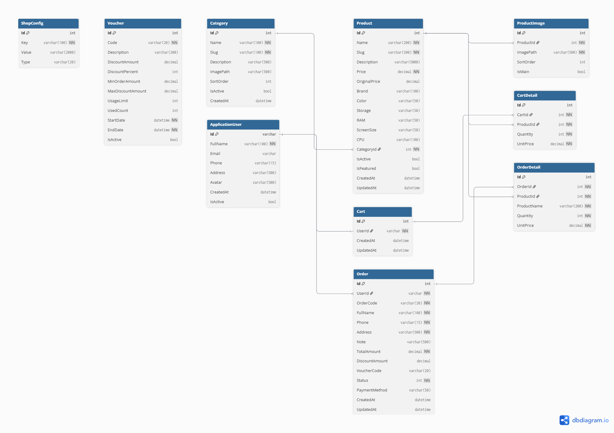

# Nexora — Tech Ecommerce

Next-gen tech, delivered. Website thương mại điện tử chuyên bán điện thoại, laptop, tablet và phụ kiện công nghệ, xây dựng bằng ASP.NET Core MVC.

## Tính năng

### Khách hàng (Storefront)

- **Trang chủ**: Hero banner, sản phẩm nổi bật, sản phẩm theo danh mục, thương hiệu
- **Danh sách sản phẩm**: Lọc theo danh mục, thương hiệu, khoảng giá, sắp xếp (giá, tên, mới nhất), phân trang
- **Chi tiết sản phẩm**: Gallery ảnh, thông số kỹ thuật (RAM, CPU, màn hình, bộ nhớ), sản phẩm liên quan
- **Giỏ hàng**: Thêm/sửa/xóa sản phẩm, cập nhật số lượng, tính tổng tiền tự động
- **Thanh toán**: Nhập thông tin giao hàng, áp dụng voucher giảm giá, xác nhận đơn hàng
- **Đơn hàng của tôi**: Xem lịch sử đơn hàng, chi tiết đơn hàng, trạng thái đơn hàng
- **Tài khoản**: Đăng ký, đăng nhập, chỉnh sửa thông tin cá nhân, đổi mật khẩu

### Trang quản trị (Admin Panel)

- **Tổng quan (Dashboard)**: Thống kê doanh thu, đơn hàng, người dùng, sản phẩm. Biểu đồ doanh thu theo tháng, đơn hàng theo trạng thái, top sản phẩm bán chạy, đơn hàng gần đây
- **Quản lý sản phẩm**: CRUD sản phẩm với ảnh, thông số kỹ thuật, danh mục, giá gốc/giá bán, trạng thái hoạt động/nổi bật
- **Quản lý danh mục**: CRUD danh mục với slug, mô tả, thứ tự sắp xếp
- **Quản lý đơn hàng**: Xem danh sách đơn hàng, lọc theo trạng thái (Chờ xác nhận / Đã xác nhận / Đang giao / Đã giao / Đã hủy), cập nhật trạng thái, xem chi tiết đơn hàng với voucher/giảm giá
- **Quản lý người dùng**: Xem danh sách người dùng, tìm kiếm, đổi vai trò (Admin/Staff/Customer), khóa/mở khóa tài khoản
- **Cấu hình cửa hàng**: Quản lý thông tin cửa hàng (tên, SĐT, email, địa chỉ, Facebook, giờ làm việc, giới thiệu)

### Hệ thống Voucher

- Giảm giá theo phần trăm (có giới hạn giảm tối đa)
- Giảm giá cố định (số tiền cụ thể)
- Điều kiện áp dụng: đơn hàng tối thiểu, giới hạn số lượt sử dụng, thời gian hiệu lực
- Trạng thái: hoạt động, hết hạn, hết lượt, vô hiệu hóa

### Xác thực & Phân quyền

- 3 vai trò: **Admin**, **Staff**, **Customer**
- Đăng ký/Đăng nhập với ASP.NET Core Identity

| Chức năng | Customer | Staff | Admin |
|-----------|:--------:|:-----:|:-----:|
| Xem sản phẩm, tìm kiếm, lọc | ✅ | ✅ | ✅ |
| Giỏ hàng & Thanh toán | ✅ | ✅ | ✅ |
| Đơn hàng của tôi | ✅ | ✅ | ✅ |
| Quản lý sản phẩm (CRUD) | ❌ | ✅ | ✅ |
| Quản lý danh mục (CRUD) | ❌ | ✅ | ✅ |
| Quản lý đơn hàng (xem, cập nhật trạng thái) | ❌ | ✅ | ✅ |
| Dashboard thống kê | ❌ | ✅ | ✅ |
| Quản lý voucher (CRUD) | ❌ | ❌ | ✅ |
| Quản lý người dùng (đổi role, khóa/mở) | ❌ | ❌ | ✅ |
| Cấu hình cửa hàng | ❌ | ❌ | ✅ |

## ERD (Entity Relationship Diagram)



## Tech Stack

- **Backend:** ASP.NET Core MVC (.NET 8)
- **ORM:** Entity Framework Core + PostgreSQL (Neon)
- **Auth:** ASP.NET Core Identity (Admin/Staff/Customer roles)
- **CSS:** Tailwind CSS 3.4 + DaisyUI 4.12
- **Client:** Alpine.js
- **Images:** Cloudinary
- **Hosting:** Railway (Railpack)

## Cấu trúc dự án

```
Nexora/
├── Areas/
│   └── Admin/
│       ├── Controllers/  # 7 Admin Controllers (Dashboard, Product, Category, Order, Voucher, User, Config)
│       └── Views/         # Admin views + _AdminLayout + _ViewImports + _ViewStart
├── Controllers/           # 5 Customer Controllers (Home, Product, Cart, Order, Account)
├── Data/
│   ├── Seeds/             # Dữ liệu seed (CategorySeed, ShopConfigSeed, VoucherSeed)
│   ├── ApplicationDbContext.cs
│   ├── SeedData.cs        # Seed vai trò & người dùng (runtime)
│   └── ProductSeeder.cs   # Seed sản phẩm từ JSON
├── Models/
│   ├── ViewModels/        # Login, Register, Checkout, ProductForm, Profile
│   ├── Product.cs, Order.cs, Cart.cs, Category.cs, Voucher.cs, ...
│   └── ApplicationUser.cs
├── Views/
│   ├── Shared/            # _Layout, Partials
│   ├── Home/, Product/, Cart/, Order/, Account/
├── Services/              # CloudinaryService (upload/delete ảnh)
├── Migrations/            # EF Core migrations
└── wwwroot/               # File tĩnh (CSS, JS, hình ảnh)
```

## Cài đặt

```bash
cd Nexora
dotnet restore
pnpm install

# Build CSS
pnpm run css:build

# Chạy migration
dotnet ef database update

# Chạy ứng dụng
dotnet watch run
```

## Biến môi trường

| Biến                       | Mô tả                                       |
| -------------------------- | -------------------------------------------- |
| `DATABASE_URL`             | Connection string PostgreSQL (Railway/Neon)  |
| `PORT`                     | Cổng server (Railway)                        |
| `Cloudinary__CloudName`    | Cloudinary cloud name                        |
| `Cloudinary__ApiKey`       | Cloudinary API key                           |
| `Cloudinary__ApiSecret`    | Cloudinary API secret                        |

## Tài khoản mặc định

| Vai trò  | Email              | Mật khẩu    |
| -------- | ------------------ | ------------ |
| Admin    | admin@nexora.vn    | Admin@123    |
| Staff    | staff@nexora.vn    | Staff@123    |
| Customer | customer@nexora.vn | Customer@123 |

## Dữ liệu seed

- **4 danh mục gốc** + 2 danh mục mở rộng (Đồng hồ thông minh, Âm thanh)
- **56 sản phẩm** từ JSON (điện thoại, laptop, tablet, phụ kiện)
- **8 voucher** (giảm %, giảm cố định, hết hạn, hết lượt, vô hiệu hóa, không yêu cầu min)
- **8 tài khoản** (1 Admin, 2 Staff, 5 Customer)
- **7 cấu hình cửa hàng**
